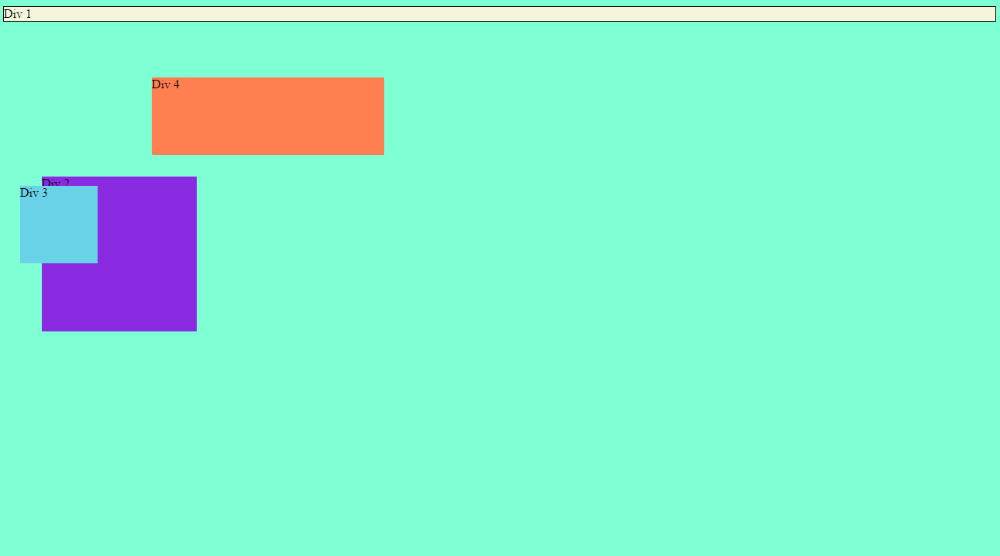
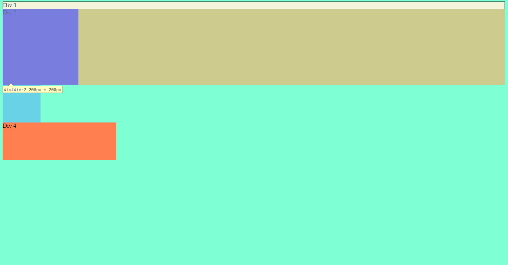
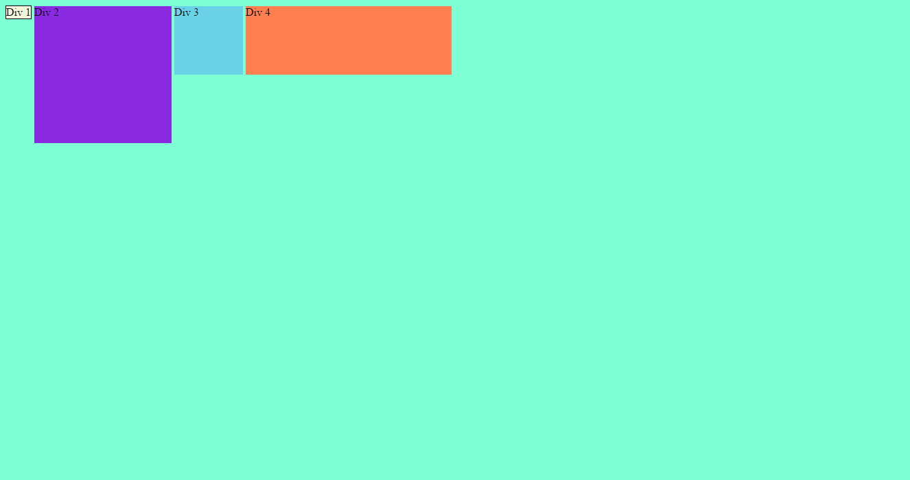
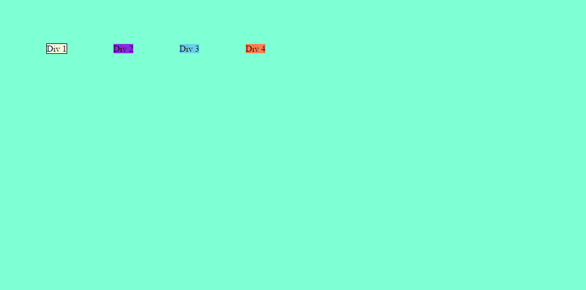
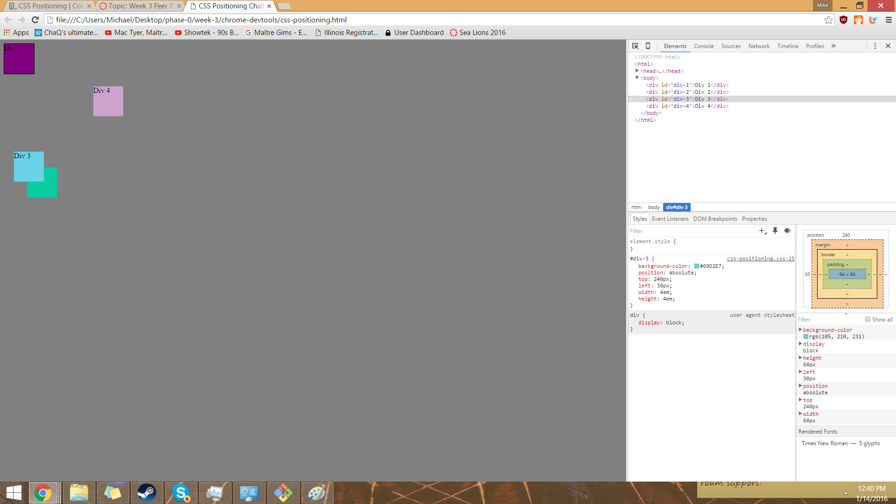
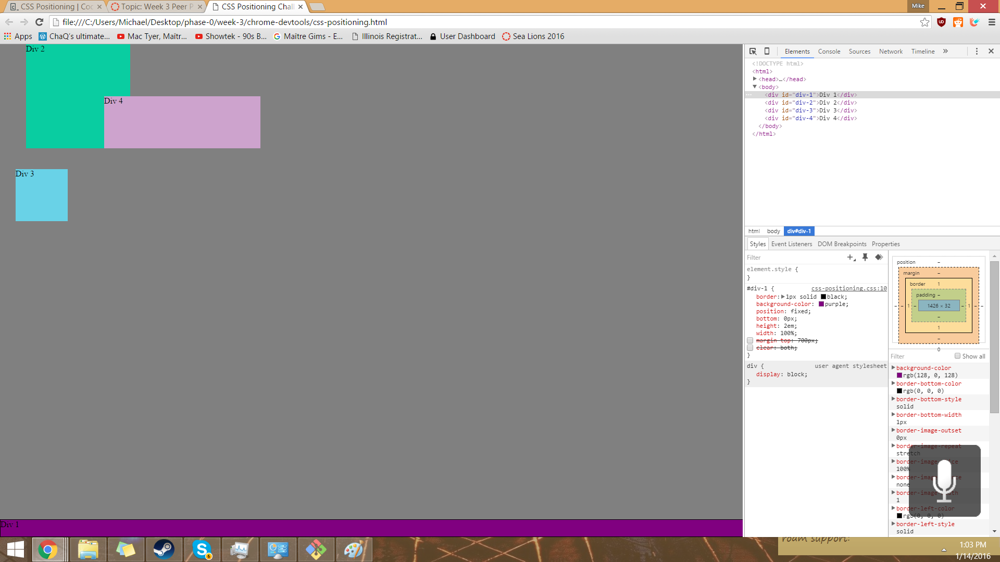
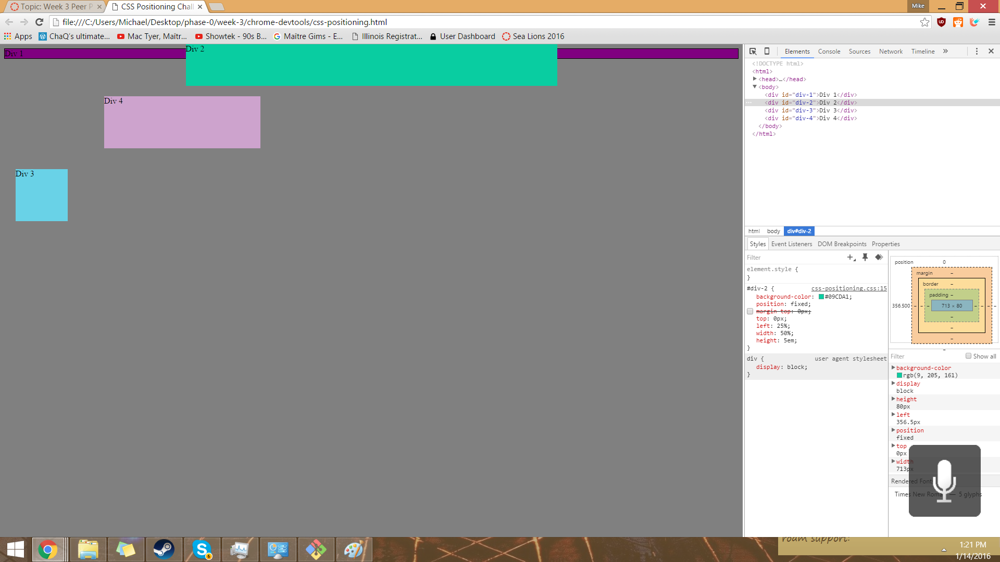
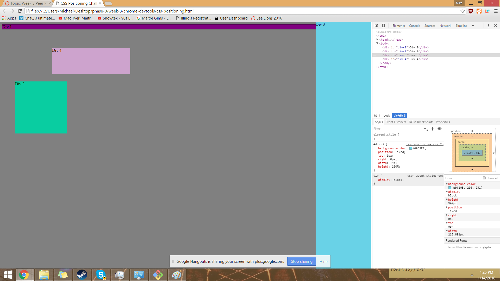
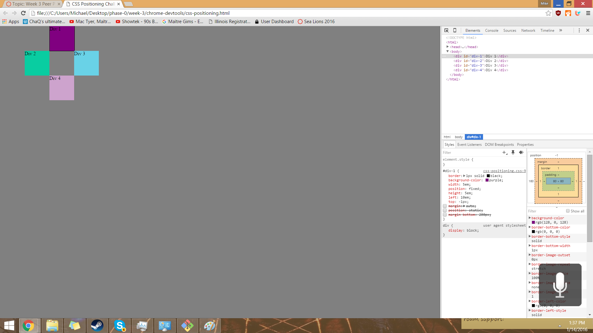

###How can you use Chrome's DevTools inspector to help you format or position elements?
It allows you to test and manipulate the webpage/dom in real-time and it organizes the dom itself

###How can you resize elements on the DOM using CSS?
By going into the stylesheet and changing the width and height and fontsize attributes.

###What are the differences between absolute, fixed, static, and relative positioning? Which did you find easiest to use? Which was most difficult?

Static is as if we did not set a positioning and it does what the html says. Its positioning can be affected by margin commands.

Absolute is at exactly the top/left/bottom/right of the page regardless of what the browser looks at and is unaffected by margin.

Fixed is kind of like absolute but the position is based on the browser and moves as it scrolls/changes size and is unaffected by margin.

Relative position is relative to its static position. px or em can be added to it

###What are the differences between margin, border, and padding?
Margin: space between the borders of the page and the element. Can't have linestyle or color

Border is the space between margin and padding, also is modifable having its linestyle and color manipulated.

Padding is the space between the element and border and can't have linestyle or color different from element.

###What was your impression of this challenge overall? (love, hate, and why?)
love/hate. Made me have to look at other resources and question assumptions made in the code academy lessons.